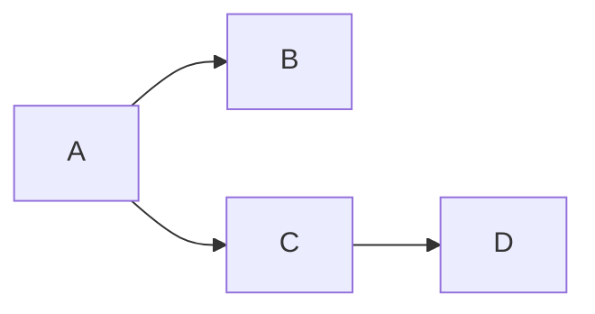

# Mermaid-Issue553
A solution to the Issue 553, how to embed Mermaid diagram into the md files of Github.

## Please look at the [web page of this](https://latitov.github.io/Mermaid-Issue553/). Go to [mermaidoc.html](mermaidoc.html), via [web page of this](https://latitov.github.io/Mermaid-Issue553/) (to see the result), and to its source code (from here).

## Also, [Mermaid Online Editor](https://mermaid-js.github.io/mermaid-live-editor/#/edit/)

----

__(The below is outdated, maybe not)__

## Problem Context

People asked for almost a decade for support of Mermaid syntax in the GitHub. Unfortunatelly, these beareucrats ignored the Issue 553 request, and then closed it with no comment. Despite all they needed to do, was to add less than 10 lines of code.

## Possible solutions:

### Use Jekyll + TeXt theme

Jekyll is a simple, blog-aware, __static site generator__ for personal, project, or organization sites. Written in Ruby by Tom Preston-Werner, GitHub's co-founder, it is distributed under the open source MIT license.

https://jekyllrb.com/

https://tianqi.name/jekyll-TeXt-theme/docs/en/quick-start

DOWNSIDE:

It only applicable if you maintain your own installation (self-host the site), and won't work for public GitHub.

### Use browser plugin

https://stackoverflow.com/a/64695218/11729048

https://addons.mozilla.org/en-US/firefox/addon/github-mermaid/?src=recommended

How this works: it just loads a mermaid.js into yor document, so any div of class "mermaid" gets processed.
 
DOWNSIDE:

It won't show diagrams for people visiting the page, who don't have that plugin installed.

## This page, as seen when the plugin is installed

